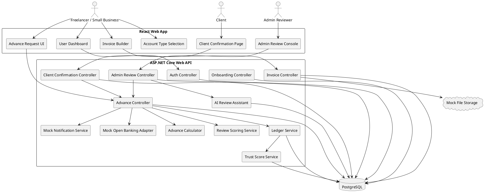
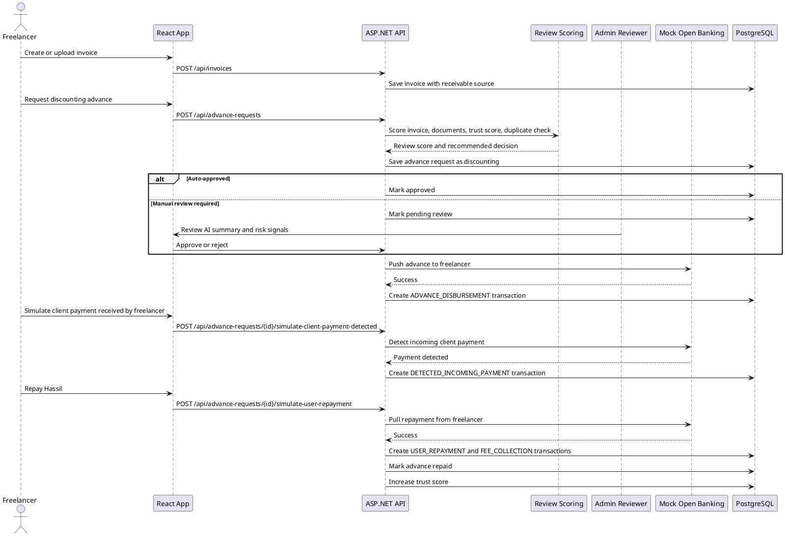
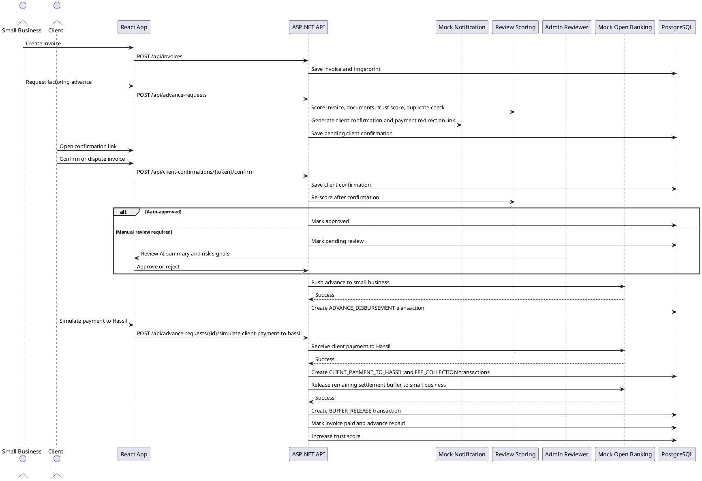
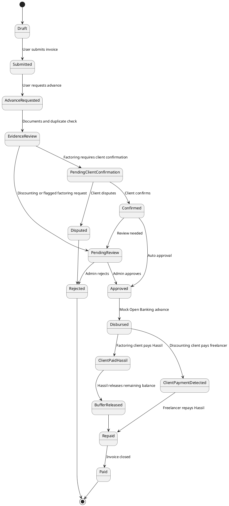

# SPEC-1-Hassil-Cash-Flow

## Table Of Contents

- [Product Overview](#product-overview)
  - [Executive Summary](#executive-summary)
  - [Key Terms](#key-terms)
  - [How Hassil Works](#how-hassil-works)
  - [Who Uses What](#who-uses-what)
  - [Status Lifecycles](#status-lifecycles)
- [Background](#background)
- [Requirements](#requirements)
  - [Must Have](#must-have)
  - [Should Have](#should-have)
  - [Could Have](#could-have)
  - [Won't Have in MVP](#wont-have-in-mvp)
- [Method](#method)
  - [1. Technical Approach](#1-technical-approach)
  - [2. Product Model](#2-product-model)
  - [3. Main Roles](#3-main-roles)
  - [4. High-Level Architecture](#4-high-level-architecture)
  - [5. Core Flow: Freelancer Discounting](#5-core-flow-freelancer-discounting)
  - [6. Core Flow: Small Business Factoring](#6-core-flow-small-business-factoring)
  - [7. Invoice and Advance State Model](#7-invoice-and-advance-state-model)
  - [8. Code-First Domain Model](#8-code-first-domain-model)
  - [9. Invoice Fingerprint Logic](#9-invoice-fingerprint-logic)
  - [10. Advance Calculation Rules](#10-advance-calculation-rules)
  - [11. Review Scoring and Approval Algorithm](#11-review-scoring-and-approval-algorithm)
  - [12. AI Review Assistant](#12-ai-review-assistant)
  - [13. Trust Score Rules](#13-trust-score-rules)
  - [14. Mock Open Banking Adapter](#14-mock-open-banking-adapter)
  - [15. API Contract](#15-api-contract)
  - [16. Backend Service Structure](#16-backend-service-structure)
  - [17. Frontend Page Structure](#17-frontend-page-structure)
  - [18. Admin Review Page](#18-admin-review-page)
  - [19. Demo Data](#19-demo-data)
  - [20. Comparable Product Patterns](#20-comparable-product-patterns)
- [Implementation](#implementation)
  - [Build Steps](#build-steps)
- [Milestones](#milestones)
  - [Day 1 — Foundation](#day-1--foundation)
  - [Day 2 — Invoice and Dashboard Core](#day-2--invoice-and-dashboard-core)
  - [Day 3 — Advance and Review Logic](#day-3--advance-and-review-logic)
  - [Day 4 — Admin, AI Summary, and Demo Polish](#day-4--admin-ai-summary-and-demo-polish)
  - [Day 5 — Final Demo and Presentation](#day-5--final-demo-and-presentation)
- [Gathering Results](#gathering-results)
  - [Product Validation](#product-validation)
  - [Technical Validation](#technical-validation)
  - [Demo Acceptance Criteria](#demo-acceptance-criteria)

## Product Overview

### Executive Summary

Hassil helps freelancers and small businesses access cash tied up in unpaid invoices. Users create invoices, see a clear advance quote, accept a fixed upfront fee, and track repayment or settlement in one workspace.

The product supports two paths: **invoice discounting** for freelancers, where the client is not notified, and **invoice factoring** for small businesses, where the client confirms the invoice and pays Hassil directly. The MVP proves the invoice flow, quote calculation, review logic, ledger trail, trust score, and admin review without moving real money.

### Key Terms

| Term | Meaning |
|---|---|
| Invoice Discounting | Private freelancer advance. Client pays the freelancer normally; freelancer repays Hassil after payment. |
| Invoice Factoring | Small business advance. Client confirms the invoice and pays Hassil directly. |
| Fixed Fee | Upfront platform fee shown before submission. It does not compound. |
| Settlement Buffer | Remaining invoice balance released to the business after client payment and fee collection. |
| Trust Score | User reliability score improved by clean repayment and confirmation history. |
| Review Score | Request-level score used to approve, reject, or route to admin review. |
| Client Confirmation | Public client step used in factoring to confirm or dispute the invoice. |

### How Hassil Works

| Flow | Simple Path |
|---|---|
| Freelancer discounting | Invoice -> quote -> advance -> client pays freelancer -> freelancer repays Hassil |
| Small business factoring | Invoice -> quote -> client confirms -> advance -> client pays Hassil -> buffer released |

### Who Uses What

| Role | Main Pages | Main Actions |
|---|---|---|
| Freelancer | Dashboard, Invoices, Advance Detail, Ledger | Request private advance, track payment, repay Hassil |
| Small Business | Dashboard, Invoices, Client Confirmation, Advance Detail | Request factoring, share confirmation, receive buffer |
| Client | Confirmation Page | Confirm or dispute invoice |
| Admin Reviewer | Admin Queue, Review Detail | Approve, reject, request more information |

### Status Lifecycles

| Object | Common Statuses |
|---|---|
| Invoice | Submitted -> Pending Client Confirmation -> Approved -> Disbursed -> Paid |
| Advance | Pending Review -> Approved -> Disbursed -> Repaid |
| Client Confirmation | Pending -> Confirmed or Disputed |

## Background

SalamHack’s fintech theme includes a Track 2 focus on financial tools for freelancers and small businesses, including invoicing, expense tracking, and cash flow management.

Hassil is a web-based cash flow management and invoice advance platform for freelancers and small businesses. The product helps users access money they have already earned but have not yet received.

This design follows the Salam Hack 2026 sandbox assumptions:

- The startup is assumed to operate under a Central Bank Regulatory Sandbox License.
- Users are assumed to have already passed KYC and AML checks.
- Transactions are treated as pre-authorized inside the sandbox.
- The product architecture is assumed to be Sharia-cleared.
- Track 2 projects may assume regional Open Banking Read/Write API access.

The core problem is that freelancers and small businesses may complete work, issue invoices, and still wait 30–60+ days before receiving payment. During that delay, salaries, rent, suppliers, taxes, tools, and bills remain due.

Hassil solves this through one platform with two financing models:

- Freelancer / Invoice Discounting: the client relationship stays private. Hassil advances part of the invoice today, the client pays the freelancer normally, and the freelancer repays Hassil after receiving client payment.
- Small Business / Invoice Factoring: the client is notified, confirms the invoice, and pays Hassil directly. Hassil advances most of the invoice value today, keeps the flat fee when the client pays, and releases the remaining balance to the business.

For the hackathon, no real money movement will occur outside simulation. Financial movement will be represented through sandbox ledger records and mocked Open Banking responses. The MVP focuses on proving the product flow, the two financing models, fee calculation, invoice lifecycle, repayment lifecycle, trust scoring, and admin review.

The MVP will be delivered as an English-only web application. It will not include a mobile app or Arabic-first interface in the hackathon scope.

## Requirements

### Must Have

| Area | Requirement |
|---|---|
| Account setup | Support Small Business and Freelancer account types with separate onboarding fields. |
| Dashboard | Show outstanding invoices, active advances, balance, trust score, and recent activity. |
| Invoices | Create invoices with client, amount, dates, terms, source, and supporting evidence. |
| Quote | Show advance amount, fixed fee, repayment amount, buffer, and terms before submission. |
| Discounting | Freelancers can request private advances without client notification. |
| Factoring | Small businesses can request advances with client confirmation and payment redirection. |
| Review | Check evidence, duplicate fingerprint, trust score, client confirmation, and request risk. |
| Repayment | Simulate model-specific repayment, fee collection, buffer release, and trust score updates. |
| Ledger | Record every advance, repayment, fee, buffer release, and trust score event. |
| Admin | Provide a reviewer queue for pending and flagged requests. |
| Scope | Web app only, English only, no real money movement. |

### Should Have

- Different limits, fees, and review rules for freelancers and small businesses.
- Duplicate prevention using invoice number, client email, amount, due date, and source.
- Seeded users and invoices covering freelancer, small business, client, and admin paths.
- AI Review Assistant that summarizes risk but never makes the final decision.
- Clean terminology that avoids interest, compounding, or debt-trap language.

### Could Have

- The system could generate a downloadable invoice PDF.
- The system could show a simple cash-flow forecast based on expected invoice payment dates.
- The system could show email notification previews for client confirmation and payment redirection.
- The system could include basic charts for monthly invoice volume, collected payments, pending advances, and trust score history.
- The system could support a single “simulate next step” button for smoother walkthroughs.

### Won't Have in MVP

- Real money movement, bank/payment gateway integration, or live Open Banking.
- Real KYC, KYB, AML, bureau checks, contracts, or regulatory workflows.
- Production fraud detection or dispute-resolution engine.
- Custom-trained AI or AI-made financing decisions.
- Mobile apps, multilingual UI, or external platform/accounting integrations.

## Method

### 1. Technical Approach

Hassil will be built as a three-layer web application:

- Frontend: React with TypeScript.
- Backend: C# ASP.NET Core Web API.
- Database: PostgreSQL using Entity Framework Core code-first migrations with the Npgsql provider.

The MVP uses a code-first approach for domain modeling. C# entities and enums are the source of truth. EF Core migrations generate the PostgreSQL schema.

The MVP simulates financial movement through a mock Open Banking adapter. Every advance, repayment, fee, and settlement event is recorded in a ledger-style transaction table.

Recommended implementation stack:

- React with TypeScript for the frontend.
- ASP.NET Core Web API with C# for the backend.
- Entity Framework Core with Npgsql for PostgreSQL persistence.
- PostgreSQL for relational storage.
- JWT-style demo authentication for role-based access.
- Local or mock file storage for supporting document uploads.
- Mock notification service for client confirmation and payment redirection previews.
- Mock Open Banking adapter for simulated disbursement, repayment, account activity, and payment detection.
- Mock or simple rule-backed AI Review Assistant for admin review.

### 2. Product Model

Hassil supports two user types and two financing models.

| User Type | Financing Model | Client Involvement | Repayment Party | Typical Advance | Typical Fee |
|---|---|---|---|---:|---:|
| Freelancer | Invoice Discounting | Client is not notified | Freelancer repays Hassil | 70–90% | 1.5–5% |
| Small Business | Invoice Factoring | Client confirms and pays Hassil | Client pays Hassil | 80–95% | 0.8–3.5% |

The two models share the same core platform services:

- User onboarding.
- Invoice creation.
- Advance quotation.
- Review and approval.
- Mock Open Banking movement.
- Ledger transactions.
- Trust score updates.
- Admin review.

The repayment path differs by model.

Freelancer / Invoice Discounting:

```text
Invoice created
Advance requested
Hassil reviews invoice evidence, work history, and trust score
Advance approved
Hassil pays freelancer
Client pays freelancer normally
Mock Open Banking detects or simulates incoming client payment
Freelancer repays advance + flat fee to Hassil
Trust score increases
```

Small Business / Invoice Factoring:

```text
Invoice created
Advance requested
Client is notified
Client confirms invoice and payment redirection
Hassil pays small business
Client pays Hassil on the original due date
Hassil keeps advance + flat fee
Hassil releases remaining settlement buffer to the business
Trust score increases
```

### 3. Main Roles

| Role | Purpose |
|---|---|
| Freelancer User | Creates or uploads invoices, requests confidential invoice discounting, repays Hassil after client payment, and builds trust score. |
| Small Business User | Creates or uploads invoices, requests invoice factoring, redirects client payment to Hassil, and builds trust score. |
| Client | Confirms or disputes a small business invoice and receives payment redirection instructions. |
| Admin Reviewer | Reviews flagged advance requests, checks risk signals, reads AI review summaries, approves, rejects, or requests more information. |

### 4. High-Level Architecture



### 5. Core Flow: Freelancer Discounting



### 6. Core Flow: Small Business Factoring



### 7. Invoice and Advance State Model



### 8. Code-First Domain Model

Use `Guid` primary keys for all major entities. Monetary values must use `decimal`, not `double` or `float`. In EF Core configuration, map money to `numeric(18,2)` and percentage/rate values to `numeric(5,4)`.

Core enums:

```csharp
public enum AccountType { SmallBusiness, Freelancer }
public enum UserRole { User, Admin }
public enum UserStatus { Active, Suspended }
public enum VerificationStatus { Verified, Rejected }

public enum FinancingModel
{
    InvoiceDiscounting,
    InvoiceFactoring
}

public enum ReceivableSource
{
    DirectClientInvoice,
    FreelancePlatformPayout
}

public enum RepaymentParty
{
    User,
    Client
}

public enum PaymentDestination
{
    UserBankAccount,
    HassilCollectionAccount
}

public enum FeeCollectionTiming
{
    AtUserRepayment,
    FromSettlementBuffer
}

public enum InvoiceStatus
{
    Draft,
    Submitted,
    AdvanceRequested,
    PendingClientConfirmation,
    Confirmed,
    Disputed,
    PendingReview,
    Approved,
    Disbursed,
    Paid,
    Rejected,
    Cancelled
}

public enum ConfirmationStatus { Pending, Confirmed, Disputed }

public enum AdvanceStatus
{
    PendingClientConfirmation,
    PendingReview,
    Approved,
    Rejected,
    Disbursed,
    ClientPaymentDetected,
    ClientPaidHassil,
    BufferReleased,
    Repaid,
    Defaulted
}

public enum ApprovalMode { Auto, Manual }

public enum TransactionType
{
    AdvanceDisbursement,
    DetectedIncomingPayment,
    UserRepayment,
    ClientPaymentToHassil,
    PlatformFee,
    BufferRelease,
    TrustScoreAdjustment
}

public enum TransactionDirection { Credit, Debit, Internal }
public enum AdminDecision { Approved, Rejected, RequestMoreInfo }
public enum AiRiskLevel { Low, Medium, High }
public enum AiRecommendedAction { Approve, ManualReview, Reject }
```

Main models/entities:

```csharp
public sealed class User
{
    public Guid Id { get; set; }
    public AccountType AccountType { get; set; }
    public UserRole Role { get; set; } = UserRole.User;
    public string Email { get; set; } = string.Empty;
    public string? Phone { get; set; }
    public string? Country { get; set; }
    public string? PasswordHash { get; set; }
    public int TrustScore { get; set; } = 40;
    public UserStatus Status { get; set; } = UserStatus.Active;
    public DateTimeOffset CreatedAt { get; set; } = DateTimeOffset.UtcNow;
    public DateTimeOffset UpdatedAt { get; set; } = DateTimeOffset.UtcNow;

    public SmallBusinessProfile? SmallBusinessProfile { get; set; }
    public FreelancerProfile? FreelancerProfile { get; set; }
    public List<Invoice> Invoices { get; set; } = new();
    public List<AdvanceRequest> AdvanceRequests { get; set; } = new();
    public List<Transaction> Transactions { get; set; } = new();
}

public sealed class SmallBusinessProfile
{
    public Guid UserId { get; set; }
    public User User { get; set; } = null!;
    public string BusinessName { get; set; } = string.Empty;
    public string RegistrationNumber { get; set; } = string.Empty;
    public string? BusinessBankAccountName { get; set; }
    public string? BusinessBankAccountLast4 { get; set; }
    public VerificationStatus VerificationStatus { get; set; } = VerificationStatus.Verified;
}

public sealed class FreelancerProfile
{
    public Guid UserId { get; set; }
    public User User { get; set; } = null!;
    public string FullName { get; set; } = string.Empty;
    public string? PersonalBankAccountName { get; set; }
    public string? PersonalBankAccountLast4 { get; set; }
    public VerificationStatus VerificationStatus { get; set; } = VerificationStatus.Verified;
}

public sealed class Client
{
    public Guid Id { get; set; }
    public string Name { get; set; } = string.Empty;
    public string Email { get; set; } = string.Empty;
    public string? Country { get; set; }
    public DateTimeOffset CreatedAt { get; set; } = DateTimeOffset.UtcNow;
    public List<Invoice> Invoices { get; set; } = new();
}

public sealed class Invoice
{
    public Guid Id { get; set; }
    public Guid UserId { get; set; }
    public User User { get; set; } = null!;
    public Guid ClientId { get; set; }
    public Client Client { get; set; } = null!;
    public string InvoiceNumber { get; set; } = string.Empty;
    public ReceivableSource ReceivableSource { get; set; } = ReceivableSource.DirectClientInvoice;
    public decimal Amount { get; set; }
    public string Currency { get; set; } = "USD";
    public DateOnly IssueDate { get; set; }
    public DateOnly DueDate { get; set; }
    public string? Description { get; set; }
    public string? PaymentTerms { get; set; }
    public InvoiceStatus Status { get; set; } = InvoiceStatus.Draft;
    public string InvoiceFingerprint { get; set; } = string.Empty;
    public DateTimeOffset CreatedAt { get; set; } = DateTimeOffset.UtcNow;
    public DateTimeOffset UpdatedAt { get; set; } = DateTimeOffset.UtcNow;

    public List<InvoiceDocument> Documents { get; set; } = new();
    public ClientConfirmation? ClientConfirmation { get; set; }
    public AdvanceRequest? AdvanceRequest { get; set; }
}

public sealed class InvoiceDocument
{
    public Guid Id { get; set; }
    public Guid InvoiceId { get; set; }
    public Invoice Invoice { get; set; } = null!;
    public string FileName { get; set; } = string.Empty;
    public string FileUrl { get; set; } = string.Empty;
    public string DocumentType { get; set; } = "Other";
    public DateTimeOffset UploadedAt { get; set; } = DateTimeOffset.UtcNow;
}

public sealed class ClientConfirmation
{
    public Guid Id { get; set; }
    public Guid InvoiceId { get; set; }
    public Invoice Invoice { get; set; } = null!;
    public string Token { get; set; } = string.Empty;
    public string ClientEmail { get; set; } = string.Empty;
    public ConfirmationStatus Status { get; set; } = ConfirmationStatus.Pending;
    public string? ClientNote { get; set; }
    public DateTimeOffset? RespondedAt { get; set; }
    public DateTimeOffset ExpiresAt { get; set; }
}

public sealed class AdvanceRequest
{
    public Guid Id { get; set; }
    public Guid InvoiceId { get; set; }
    public Invoice Invoice { get; set; } = null!;
    public Guid UserId { get; set; }
    public User User { get; set; } = null!;

    public FinancingModel FinancingModel { get; set; }
    public RepaymentParty RepaymentParty { get; set; }
    public PaymentDestination PaymentDestination { get; set; }
    public FeeCollectionTiming FeeCollectionTiming { get; set; }
    public bool ClientNotificationRequired { get; set; }
    public bool ClientPaymentRedirectRequired { get; set; }

    public decimal RequestedPercent { get; set; }
    public decimal AdvanceAmount { get; set; }
    public decimal FeeRate { get; set; }
    public decimal FeeAmount { get; set; }
    public decimal SettlementBufferAmount { get; set; }
    public decimal ExpectedRepaymentAmount { get; set; }

    public int ReviewScore { get; set; }
    public ApprovalMode? ApprovalMode { get; set; }
    public AdvanceStatus Status { get; set; } = AdvanceStatus.PendingReview;
    public string? RejectionReason { get; set; }
    public Guid? ReviewedBy { get; set; }
    public DateTimeOffset? ReviewedAt { get; set; }

    public DateTimeOffset? TermsAcceptedAt { get; set; }
    public string TermsVersion { get; set; } = "hackathon-v1";

    public DateTimeOffset CreatedAt { get; set; } = DateTimeOffset.UtcNow;
    public DateTimeOffset UpdatedAt { get; set; } = DateTimeOffset.UtcNow;

    public List<Transaction> Transactions { get; set; } = new();
    public List<AiReviewSnapshot> AiReviewSnapshots { get; set; } = new();
}

public sealed class Transaction
{
    public Guid Id { get; set; }
    public Guid UserId { get; set; }
    public User User { get; set; } = null!;
    public Guid? InvoiceId { get; set; }
    public Invoice? Invoice { get; set; }
    public Guid? AdvanceRequestId { get; set; }
    public AdvanceRequest? AdvanceRequest { get; set; }
    public TransactionType Type { get; set; }
    public TransactionDirection Direction { get; set; }
    public decimal Amount { get; set; }
    public string? Description { get; set; }
    public DateTimeOffset CreatedAt { get; set; } = DateTimeOffset.UtcNow;
}

public sealed class TrustScoreEvent
{
    public Guid Id { get; set; }
    public Guid UserId { get; set; }
    public User User { get; set; } = null!;
    public int OldScore { get; set; }
    public int NewScore { get; set; }
    public string Reason { get; set; } = string.Empty;
    public DateTimeOffset CreatedAt { get; set; } = DateTimeOffset.UtcNow;
}

public sealed class AdminReview
{
    public Guid Id { get; set; }
    public Guid AdvanceRequestId { get; set; }
    public AdvanceRequest AdvanceRequest { get; set; } = null!;
    public Guid ReviewerUserId { get; set; }
    public User ReviewerUser { get; set; } = null!;
    public AdminDecision Decision { get; set; }
    public string? Notes { get; set; }
    public DateTimeOffset CreatedAt { get; set; } = DateTimeOffset.UtcNow;
}

public sealed class AiReviewSnapshot
{
    public Guid Id { get; set; }
    public Guid AdvanceRequestId { get; set; }
    public AdvanceRequest AdvanceRequest { get; set; } = null!;
    public AiRiskLevel RiskLevel { get; set; }
    public AiRecommendedAction RecommendedAction { get; set; }
    public string Summary { get; set; } = string.Empty;
    public string RiskFlagsJson { get; set; } = "[]";
    public string ModelName { get; set; } = "mock-ai-review-v1";
    public DateTimeOffset CreatedAt { get; set; } = DateTimeOffset.UtcNow;
}
```

EF Core configuration summary:

```csharp
protected override void OnModelCreating(ModelBuilder modelBuilder)
{
    modelBuilder.Entity<User>()
        .HasIndex(x => x.Email)
        .IsUnique();

    modelBuilder.Entity<SmallBusinessProfile>()
        .HasKey(x => x.UserId);

    modelBuilder.Entity<SmallBusinessProfile>()
        .HasIndex(x => x.RegistrationNumber)
        .IsUnique();

    modelBuilder.Entity<FreelancerProfile>()
        .HasKey(x => x.UserId);

    modelBuilder.Entity<Invoice>()
        .HasIndex(x => x.InvoiceFingerprint)
        .IsUnique();

    modelBuilder.Entity<Invoice>()
        .Property(x => x.Amount)
        .HasPrecision(18, 2);

    modelBuilder.Entity<AdvanceRequest>()
        .HasIndex(x => x.InvoiceId)
        .IsUnique();

    modelBuilder.Entity<AdvanceRequest>()
        .Property(x => x.AdvanceAmount)
        .HasPrecision(18, 2);

    modelBuilder.Entity<AdvanceRequest>()
        .Property(x => x.FeeAmount)
        .HasPrecision(18, 2);

    modelBuilder.Entity<AdvanceRequest>()
        .Property(x => x.SettlementBufferAmount)
        .HasPrecision(18, 2);

    modelBuilder.Entity<AdvanceRequest>()
        .Property(x => x.ExpectedRepaymentAmount)
        .HasPrecision(18, 2);

    modelBuilder.Entity<AdvanceRequest>()
        .Property(x => x.FeeRate)
        .HasPrecision(5, 4);

    modelBuilder.Entity<Transaction>()
        .Property(x => x.Amount)
        .HasPrecision(18, 2);

    modelBuilder.Entity<ClientConfirmation>()
        .HasIndex(x => x.Token)
        .IsUnique();
}
```

### 9. Invoice Fingerprint Logic

The MVP prevents duplicate invoice submissions by creating a deterministic fingerprint.

Fingerprint input:

```text
normalized_invoice_number + normalized_client_email + amount + due_date + receivable_source
```

Normalization rules:

- Trim spaces.
- Convert email and invoice number to lowercase.
- Format amount to two decimals.
- Format due date as `YYYY-MM-DD`.
- Include receivable source so platform payouts and direct client invoices do not accidentally collide.

Pseudocode:

```text
function createInvoiceFingerprint(invoiceNumber, clientEmail, amount, dueDate, receivableSource):
    raw = lower(trim(invoiceNumber)) + "|" + lower(trim(clientEmail)) + "|" + formatMoney(amount) + "|" + formatDate(dueDate) + "|" + receivableSource
    return sha256(raw)
```

If the fingerprint already exists, the API rejects the invoice or sends the related advance request to manual review.

### 10. Advance Calculation Rules

The advance proposal must be shown before the user confirms.

Freelancer discounting calculation:

```text
invoice_amount = full invoice value
advance_amount = invoice_amount * advance_percent
fee_amount = invoice_amount * fee_rate
settlement_buffer_amount = 0
expected_repayment_amount = advance_amount + fee_amount
```

Small business factoring calculation:

```text
invoice_amount = full invoice value
advance_amount = invoice_amount * advance_percent
fee_amount = invoice_amount * fee_rate
settlement_buffer_amount = invoice_amount - advance_amount - fee_amount
expected_repayment_amount = invoice_amount
```

For factoring, the client pays Hassil the full invoice amount. Hassil keeps the advance recovery and flat fee, then releases the settlement buffer to the business.

MVP limits:

| User Type | Model | Trust Score | Max Advance % | Max Invoice Eligible | Fee Range |
|---|---|---:|---:|---:|---:|
| Freelancer | Discounting | 0–49 | 70% | $1,000 | 4.0–5.0% |
| Freelancer | Discounting | 50–79 | 80% | $3,000 | 2.5–4.0% |
| Freelancer | Discounting | 80–100 | 90% | $5,000 | 1.5–2.5% |
| Small Business | Factoring | 0–49 | 80% | $10,000 | 2.8–3.5% |
| Small Business | Factoring | 50–79 | 90% | $25,000 | 1.5–2.8% |
| Small Business | Factoring | 80–100 | 95% | $50,000 | 0.8–1.5% |

Example: freelancer discounting

```text
Invoice amount: $800
Advance percent: 80%
Fee rate: 4%
Advance amount: $640
Fee amount: $32
Client later pays freelancer: $800
Freelancer repays Hassil: $672
```

Example: small business factoring

```text
Invoice amount: $20,000
Advance percent: 90%
Fee rate: 2%
Advance amount: $18,000
Fee amount: $400
Client later pays Hassil: $20,000
Hassil releases settlement buffer to business: $1,600
```

### 11. Review Scoring and Approval Algorithm

The MVP combines deterministic scoring with manual review. This is intentionally lightweight. It is not a production-grade fraud engine or regulatory decision system.

Automatic rejection conditions:

- Client disputes the invoice.
- Invoice fingerprint already exists and is linked to another active or paid invoice.
- Due date is in the past.
- Due date is more than 90 days away.
- Invoice amount exceeds the hard limit for the user type and trust score.
- User profile is suspended.
- Terms were not accepted.

Automatic approval conditions:

- Terms were accepted.
- At least one supporting document exists.
- Invoice amount is within the trust-based limit.
- User trust score is 50 or higher.
- No duplicate invoice fingerprint exists.
- Due date is within 90 days.
- For small business factoring, the client has confirmed the invoice and payment redirection.
- For freelancer discounting, the request has enough evidence without client notification.

Manual review conditions:

- Trust score is below 50 but other checks pass.
- Supporting document is missing.
- Invoice amount is close to the maximum allowed limit.
- Client confirmation is delayed for factoring.
- User is new and has no repayment history.
- AI Review Assistant returns “Medium” risk.

Review scoring pseudocode:

```text
function scoreAdvance(user, invoice, documents, confirmation, advanceRequest):
    score = 100

    if user.status != "ACTIVE": score -= 100
    if advanceRequest.termsAcceptedAt is null: score -= 100
    if invoice.isDuplicate: score -= 60
    if documents.count == 0: score -= 25
    if daysUntilDue(invoice.dueDate) > 90: score -= 40
    if daysUntilDue(invoice.dueDate) < 0: score -= 100
    if user.trustScore < 50: score -= 20
    if invoice.amount > maxEligibleAmount(user.accountType, user.trustScore): score -= 35

    if advanceRequest.financingModel == "InvoiceFactoring":
        if confirmation.status == "DISPUTED": score -= 100
        if confirmation.status != "CONFIRMED": score -= 35

    if advanceRequest.financingModel == "InvoiceDiscounting":
        if invoice.receivableSource == "FreelancePlatformPayout": score += 5

    return clamp(score, 0, 100)
```

Approval decision pseudocode:

```text
function decideAdvance(user, invoice, score, confirmation, advanceRequest):
    if score < 40:
        return REJECTED

    if advanceRequest.financingModel == "InvoiceFactoring" and confirmation.status != "CONFIRMED":
        return PENDING_CLIENT_CONFIRMATION

    if score >= 75 and user.trustScore >= 50 and invoice.hasSupportingDocument:
        return APPROVED_AUTO

    return PENDING_MANUAL_REVIEW
```

### 12. AI Review Assistant

AI is used as a review assistant, not as the source of truth.

The deterministic rule engine calculates the review score. The AI Review Assistant summarizes the signals for the admin reviewer.

Input example:

```json
{
  "userType": "SmallBusiness",
  "financingModel": "InvoiceFactoring",
  "trustScore": 65,
  "invoiceAmount": 20000,
  "clientConfirmation": "Confirmed",
  "supportingDocuments": 1,
  "previousSuccessfulRepayments": 1,
  "duplicateInvoice": false,
  "dueInDays": 60
}
```

Output example:

```json
{
  "riskLevel": "Low",
  "recommendedAction": "Approve",
  "summary": "The request appears reliable because the client confirmed the invoice, the user has successful repayment history, and no duplicate invoice was detected.",
  "riskFlags": []
}
```

Simple MVP behavior:

```text
If review score >= 75 -> Low risk, recommend approve
If review score is 50–74 -> Medium risk, recommend manual review
If review score < 50 -> High risk, recommend reject
```

The frontend shows this as an “AI Review Summary” card on the admin review detail page.

### 13. Trust Score Rules

Every new user starts with a trust score of 40.

Trust score changes:

| Event | Score Change |
|---|---:|
| Profile completed | +5 |
| Supporting document added | +3 |
| Client confirms factoring invoice | +5 |
| Advance repaid on time | +10 |
| Advance repaid late | -10 |
| Client disputes invoice | -20 |
| Duplicate invoice attempt | -30 |
| Admin rejects request for suspicious evidence | -15 |

Trust score must always stay between 0 and 100.

For demo purposes:

- Small business demo user starts at 60.
- Freelancer demo user starts at 55.

### 14. Mock Open Banking Adapter

Track 2 allows the MVP to assume regional Open Banking Read/Write API access. Hassil will represent this through a mock adapter.

```csharp
public interface IOpenBankingGateway
{
    Task<BankTransferResult> PushAdvanceToUserAsync(
        Guid userId,
        decimal amount,
        string currency,
        string description);

    Task<BankTransactionDetectionResult> DetectIncomingClientPaymentToUserAsync(
        Guid userId,
        Guid invoiceId,
        decimal expectedAmount,
        string currency);

    Task<BankTransferResult> PullRepaymentFromUserAsync(
        Guid userId,
        decimal amount,
        string currency,
        string description);

    Task<BankTransferResult> ReceiveClientPaymentToHassilAsync(
        Guid clientId,
        Guid invoiceId,
        decimal amount,
        string currency);

    Task<BankTransferResult> ReleaseBufferToUserAsync(
        Guid userId,
        decimal amount,
        string currency,
        string description);

    Task<IReadOnlyList<BankTransactionDto>> GetRecentTransactionsAsync(Guid userId);
}
```

Mock behavior:

- `PushAdvanceToUserAsync` returns successful transfer for approved disbursement.
- `DetectIncomingClientPaymentToUserAsync` returns a detected payment for freelancer discounting demos.
- `PullRepaymentFromUserAsync` returns successful repayment from freelancer to Hassil.
- `ReceiveClientPaymentToHassilAsync` returns successful client payment for small business factoring.
- `ReleaseBufferToUserAsync` returns successful settlement buffer release.
- `GetRecentTransactionsAsync` returns hardcoded JSON transactions for dashboard activity.

### 15. API Contract

Authentication and demo setup:

| Method | Endpoint | Purpose |
|---|---|---|
| POST | `/api/auth/demo-login` | Log in as seeded small business, freelancer, or admin. |
| POST | `/api/demo/seed` | Seed demo data for the hackathon presentation. |

Onboarding:

| Method | Endpoint | Purpose |
|---|---|---|
| POST | `/api/onboarding/small-business` | Create small business user profile. |
| POST | `/api/onboarding/freelancer` | Create freelancer user profile. |
| GET | `/api/users/me` | Get current user, profile, and trust score. |

Invoices:

| Method | Endpoint | Purpose |
|---|---|---|
| POST | `/api/invoices` | Create invoice. |
| GET | `/api/invoices` | List invoices for current user. |
| GET | `/api/invoices/{id}` | Get invoice details. |
| POST | `/api/invoices/{id}/documents` | Upload supporting document placeholder. |
| POST | `/api/invoices/{id}/submit` | Submit invoice for advance eligibility. |

Advance requests:

| Method | Endpoint | Purpose |
|---|---|---|
| POST | `/api/advance-requests/quote` | Calculate advance amount, fee, buffer, repayment amount, and eligibility. |
| POST | `/api/advance-requests` | Create advance request and store accepted terms. |
| GET | `/api/advance-requests` | List current user’s advance requests. |
| GET | `/api/advance-requests/{id}` | Get advance details. |
| POST | `/api/advance-requests/{id}/simulate-disbursement` | Simulate approved advance release. |
| POST | `/api/advance-requests/{id}/simulate-client-payment-detected` | Simulate freelancer receiving client payment. |
| POST | `/api/advance-requests/{id}/simulate-user-repayment` | Simulate freelancer repayment to Hassil. |
| POST | `/api/advance-requests/{id}/simulate-client-payment-to-hassil` | Simulate factoring client payment to Hassil. |
| POST | `/api/advance-requests/{id}/simulate-buffer-release` | Simulate release of remaining settlement buffer to small business. |

Client confirmation:

| Method | Endpoint | Purpose |
|---|---|---|
| GET | `/api/client-confirmations/{token}` | Get invoice confirmation details for client. |
| POST | `/api/client-confirmations/{token}/confirm` | Client confirms invoice and payment redirection. |
| POST | `/api/client-confirmations/{token}/dispute` | Client disputes invoice. |

Admin review:

| Method | Endpoint | Purpose |
|---|---|---|
| GET | `/api/admin/advance-requests/pending` | List pending manual reviews. |
| GET | `/api/admin/advance-requests/{id}` | View review flags, AI summary, and verification checklist. |
| POST | `/api/admin/advance-requests/{id}/approve` | Approve request manually. |
| POST | `/api/admin/advance-requests/{id}/reject` | Reject request with reason. |
| POST | `/api/admin/advance-requests/{id}/request-more-info` | Mark request as needing more evidence. |
| POST | `/api/admin/advance-requests/{id}/ai-review` | Generate or refresh AI review summary. |

Dashboard:

| Method | Endpoint | Purpose |
|---|---|---|
| GET | `/api/dashboard/summary` | Show outstanding invoices, active advances, balance, trust score, and model-specific activity. |
| GET | `/api/transactions` | Show transaction history. |
| GET | `/api/trust-score/events` | Show trust score history. |

### 16. Backend Service Structure

```text
Hassil.Api/
  ApiEndpoints.cs
  Program.cs
  Authentication/
    DemoBearerAuthenticationDefaults.cs
    DemoBearerAuthenticationHandler.cs
  Contracts/
    AdvanceRequests/
      AdvanceRequestRequests.cs
      AdvanceRequestResponses.cs
    Auth/
      AuthRequests.cs
      AuthResponses.cs
    ClientConfirmations/
      ClientConfirmationRequests.cs
      ClientConfirmationResponses.cs
    Demo/
      DemoResponses.cs
    Invoices/
      InvoiceRequests.cs
      InvoiceResponses.cs
    Users/
      UserResponses.cs
  Controllers/
    AdvanceRequestsController.cs
    AuthController.cs
    ClientConfirmationsController.cs
    InvoicesController.cs
    DemoController.cs
    UsersController.cs
  Database/
    Configurations/
    Migrations/
    HassilDbContext.cs
  Domain/
    Enums/
    Models/
  Exceptions/
    AppException.cs
  Mappings/
    AdvanceRequestMappings.cs
    AuthMappings.cs
    ClientConfirmationMappings.cs
    DemoMappings.cs
    InvoiceMappings.cs
    UserMappings.cs
  Middleware/
    ErrorHandlingMiddleware.cs
  Services/
    AdvanceRequests/
      AdvanceCalculatorService.cs
      AdvanceQuote.cs
      AdvanceRequestService.cs
      IAdvanceCalculatorService.cs
      IAdvanceRequestService.cs
      IReviewScoringService.cs
      ReviewScoringService.cs
    Auth/
      AuthService.cs
      DemoTokenService.cs
      IAuthService.cs
      IDemoTokenService.cs
    Demo/
      DemoSeedService.cs
      IDemoSeedService.cs
    ClientConfirmations/
      ClientConfirmationService.cs
      IClientConfirmationService.cs
    Invoices/
      IInvoiceFingerprintService.cs
      IInvoiceService.cs
      InvoiceFingerprintService.cs
      InvoiceService.cs
    Ledger/
      ILedgerService.cs
      LedgerService.cs
    OpenBanking/
      IOpenBankingGateway.cs
      MockOpenBankingGateway.cs
    Notifications/
      IMockNotificationService.cs
      MockNotificationService.cs
```

Core services:

| Service | Responsibility |
|---|---|
| InvoiceFingerprintService | Normalizes invoice data and generates duplicate-detection hash. |
| AdvanceCalculatorService | Calculates model-specific advance, fee, buffer, and repayment values. |
| ReviewScoringService | Applies deterministic review rules and returns approval recommendation. |
| AiReviewService | Produces a short admin-facing review summary and risk explanation. |
| TrustScoreService | Updates trust score and writes trust score events. |
| LedgerService | Writes ledger transactions for disbursement, repayment, fee collection, and buffer release. |
| MockOpenBankingGateway | Simulates Open Banking read/write operations. |
| MockNotificationService | Creates confirmation token and mock email preview for factoring clients. |
| DemoSeedService | Creates preloaded users, invoices, advances, transactions, and trust-score events. |

### 17. Frontend Page Structure

Suggested React routes:

```text
/                                      Landing and account-type selection
/onboarding/small-business             Small business onboarding
/onboarding/freelancer                 Freelancer onboarding
/login                                 Demo login
/dashboard                             User dashboard
/invoices/new                          Invoice builder
/invoices/:id                          Invoice detail
/invoices/:id/advance                  Advance quote and request
/advances/:id                          Advance detail and repayment status
/client/confirm/:token                 Public client confirmation page for factoring
/admin                                 Admin review dashboard
/admin/advances/:id                    Admin review detail with AI summary
/transactions                          User transaction history
```

Key UI components:

- AccountTypeSelector
- DashboardSummaryCards
- TrustScoreBadge
- InvoiceForm
- ReceivableSourceSelector
- AdvanceQuoteCard
- FinancingModelBadge
- VerificationChecklist
- ClientConfirmationPanel
- AdminReviewFlags
- AiReviewSummaryCard
- TransactionTimeline

### 18. Admin Review Page

The admin page proves that Hassil has model-aware approval logic without building production compliance infrastructure.

For each pending advance, show:

- User type: Small Business or Freelancer.
- Financing model: Factoring or Discounting.
- Repayment party: Client or User.
- Client notification required: Yes or No.
- User profile completeness.
- Trust score.
- Invoice amount and due date.
- Requested advance percentage.
- Fee amount and fee rate.
- Supporting document status.
- Duplicate invoice fingerprint result.
- Client confirmation status when required.
- Review score.
- AI Review Summary.
- Review flags.
- Recommended decision.

Admin actions:

- Approve.
- Reject with reason.
- Request more information.
- Refresh AI review summary.

### 19. Demo Data

Seed the application with four demo identities:

| Identity | Role | Purpose |
|---|---|---|
| Ahmed Studio | Small Business User | Main factoring demo account with active invoice and previous repayment. |
| Sara Designs | Freelancer User | Main discounting demo account with smaller invoice and previous repayment. |
| Omar Client | Client | Confirms Ahmed Studio’s invoice and redirects payment to Hassil. |
| Admin Reviewer | Admin | Reviews flagged requests and views AI Review Summary. |

Seeded records:

- One completed small business factoring invoice and repayment.
- One completed freelancer discounting invoice and repayment.
- One draft small business invoice for live demo creation.
- One draft freelancer invoice for live demo creation.
- One pending manual review request for the admin dashboard.
- One AI review snapshot for a pending request.
- Hardcoded mock bank transactions returned by the Open Banking adapter.

### 20. Comparable Product Patterns

Hassil follows known patterns from invoice financing, invoice discounting, invoice factoring, and embedded finance products:

- Invoice discounting keeps the client relationship private and places repayment responsibility on the invoice issuer.
- Invoice factoring introduces the financing provider to the client and redirects payment to the provider.
- Embedded finance products bring working-capital access directly into the software workflows businesses already use.
- Accounting and invoicing products often use cash-flow visibility as the entry point before offering financing.

Hassil’s MVP should not attempt to copy a full lender, factoring company, compliance platform, or banking system. The hackathon version should focus on the workflow that proves the concept:

```text
invoice created -> advance quoted -> review signals checked -> advance simulated -> repayment path simulated -> trust score improves
```

## Implementation

### Build Steps

1. Create the repository structure.
   - `/frontend` for React.
   - `/backend` for ASP.NET Core Web API.
   - `/docs` for demo scripts and API notes.

2. Implement backend domain models.
   - Add enums and entities.
   - Configure EF Core mappings.
   - Create the first migration.
   - Seed demo data.

3. Build authentication and demo login.
   - Seed small business user.
   - Seed freelancer user.
   - Seed admin user.
   - Use simple JWT-style demo auth.

4. Build onboarding.
   - Small business onboarding.
   - Freelancer onboarding.
   - Store verified placeholder bank details.

5. Build invoice creation.
   - Add direct client invoice and freelance platform payout sources.
   - Generate invoice fingerprint.
   - Block or flag duplicates.
   - Add supporting document placeholder upload.

6. Build advance quote engine.
   - Use account type to choose default financing model.
   - Apply trust-score-based limits.
   - Calculate fee, advance, repayment amount, and settlement buffer.
   - Require terms acceptance.

7. Build model-specific advance flows.
   - Freelancer: no client notification, payment detection, user repayment.
   - Small business: client confirmation, payment redirection, client payment to Hassil, buffer release.

8. Build admin review console.
   - Show risk flags.
   - Show deterministic review score.
   - Show AI Review Summary.
   - Support approve, reject, and request more information.

9. Build ledger and trust score.
   - Record every simulated money movement.
   - Update trust score after successful repayment.
   - Show transaction history and trust score events.

10. Polish demo flow.
   - Add seeded data.
   - Add clear model badges: “Invoice Discounting” and “Invoice Factoring.”
   - Add one-click simulation buttons.
   - Test the full presentation path repeatedly.

## Milestones

### Day 1 — Foundation

- Confirm final scope.
- Create frontend and backend projects.
- Add PostgreSQL and EF Core configuration.
- Implement code-first entities and first migration.
- Add demo seed service.
- Build basic landing and account-type selection.

### Day 2 — Invoice and Dashboard Core

- Build onboarding forms.
- Build dashboard summary cards.
- Build invoice creation flow.
- Implement invoice fingerprinting.
- Implement supporting document placeholder.
- Seed Ahmed Studio and Sara Designs demo data.

### Day 3 — Advance and Review Logic

- Implement advance quote engine.
- Implement freelancer discounting flow.
- Implement small business factoring flow.
- Implement mock Open Banking adapter.
- Implement ledger service.
- Implement deterministic review scoring.

### Day 4 — Admin, AI Summary, and Demo Polish

- Build admin review dashboard.
- Add AI Review Summary card.
- Build client confirmation page.
- Add model-specific simulation buttons.
- Add transaction timeline.
- Fix UI copy and make all terminology consistent.

### Day 5 — Final Demo and Presentation

- Freeze feature development.
- Rehearse the two-user demo.
- Prepare backup screenshots or screen recording.
- Validate seeded data.
- Test the full path from invoice to repayment for both models.
- Finalize pitch deck and speaking script.

## Gathering Results

The MVP should be evaluated against product, technical, and demo success criteria.

### Product Validation

| Question | Success Signal |
|---|---|
| Do users understand the difference between the two models? | Users can explain discounting vs factoring after seeing the quote screen. |
| Is the fee clear? | Users can see advance amount, fee, repayment amount, and buffer before confirming. |
| Does the product avoid interest-based framing? | UI uses flat-fee language consistently. |
| Does the flow feel faster than bank financing? | Demo shows quote, review, and simulated disbursement in minutes. |
| Does the trust score make sense? | Admin page shows the exact reasons behind score changes. |

### Technical Validation

| Area | Target |
|---|---|
| API reliability | All demo endpoints return successful responses during rehearsal. |
| Quote calculation | Fee, advance, repayment, and buffer math match the business model examples. |
| Ledger consistency | Every simulated money movement creates a transaction record. |
| Trust score update | Successful repayment updates score and creates an event. |
| Model behavior | Freelancer flow skips client confirmation; small business flow requires it. |
| Admin review | Admin can approve, reject, request more info, and view AI summary. |

### Demo Acceptance Criteria

The final demo should successfully show:

1. A small business creates an invoice.
2. The small business requests invoice factoring.
3. The client confirms and redirects payment to Hassil.
4. Hassil simulates advance disbursement.
5. The client payment is simulated.
6. Hassil releases the settlement buffer.
7. Trust score improves.
8. A freelancer creates or uploads an invoice.
9. The freelancer requests invoice discounting.
10. Hassil advances money without notifying the client.
11. Client payment to freelancer is simulated.
12. Freelancer repayment to Hassil is simulated.
13. Admin reviewer sees review flags and AI Review Summary.
